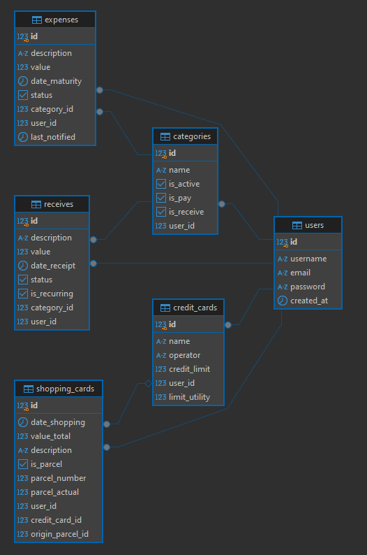

# Processo seletivo - QA

Olá, prezados. 

Fico feliz em poder participar do processo seletivo para este cargo, é gratificante o reconhecimento e esforço que foi dedicado durante o processo de desenvolvimento.

Apresento a vocês meu projeto chamado MyFinance, destinado ao controle financeiro doméstico pessoal.

## Informações do projeto
- Linguagem utilizada: PHP
- Versão da linguagem: 7.4.33
- Framework utilizado: CakePHP3
- Banco de dados utilizado: PostgreSQL
- Template utilizado: Bootstrap (CorporateUI)
- Arquitetura utilizada: Models, Views e Controllers (MVC)

- Modelagem de Dados:

A imagem da modelagem de dados pode ser encontrado na raiz, com o nome de modelagem.png

## Softwares utilizados
- VsCode
- DBeaver
- Wampserver (Download em: https://wampserver.aviatechno.net/)
- Executado em Windows

## Requisitos para inicialização do projeto
- Ter composer instalado na máquina (Download https://getcomposer.org/download/)
- Ter XAMPP ou Wampserver instalado na máquina para aplicações em PHP
- Ajustar o PHP.ini para permitir as extenções para o PostgreSQL (extension=pdo_pgsql e extension=pgsql)
- Após ter o projeto em mãos, deve abrir o terminal no mesmo diretório e rodar o seguinte comando:
     - composer update (se der algum erro, execute composer install).
- Após terminar todas as atualizações do composer, deve estar criando o banco de dados de acordo com o arquivo 20240913_create_tables.php e depois 20240914_alter_table_expense.php.

## Conexão com o banco de dados
   - Abra o arquivo app_local localizado dentro da pasta config.
   - Configure a sessão Datasources para o exemplo abaixo, de acordo com os dados que foi criado o banco de dados:

    'Datasources' => [
        'default' => [
            'className' => 'Cake\Database\Connection',
            'driver' => 'Cake\Database\Driver\Postgres',
            'persistent' => false,
            'host' => 'localhost',
            'username' => 'postgres',
            'password' => 'root',
            'database' => 'postgres',
            'encoding' => 'utf8',
            'timezone' => 'UTC',
            'schema' => 'public',
            'cacheMetadata' => true,
            'quoteIdentifiers' => true,
            'url' => env('DATABASE_URL', null),
        ],
    ],

## Instruções para a execução do projeto
  - Com o XAMPP ou Wampserver rodando, basta abrir o terminal dentro da pasta do projeto e rodar o seguinte comando: bin/cake server
  - Por padrão o projeto será executado na seguinte URL: http://localhost:8765/login
  - Basta acessar a URL, e estar criando um usuário na opção: http://localhost:8500/users/adicionar ou clicando em Registre-se
  - Depois será redirecionado a tela de login novamente, onde poderá estar logando em sua conta.

## Informações extras
- Os documentos solicitados como algum documento com foto, histórico de escolaridade estão presentes na raiz deste projeto, na pasta **Documentação**

## Funcionalidades Implementadas

Módulo de Contas a Pagar:
- Presente no sistema na seção Contas a Pagar
- Todas as funcionalidades foram implementadas.
- Obs: A notificação/lembrete está executando através de uma função definida na AppController, notificará o usuário logado a cada 10 minutos se estiver notificação com a data de vencimento do dia atual ou até 3 dias antes de vencer e com o status diferente de Pago, ou seja apenas Pendentes. (Foi implementada no dashboard, e também no módulo de contas a pagar para ser visualizada a notificação).

Módulo de Contas a Receber:
- Presente no sistema na seção Contas a Receber
- Todas as funcionalidades foram implementadas.
- Obs: A receita recorrente será sempre gerada no dia correspondente ao mês seguinte de forma automática. Função implementada dentro da AppController.

Módulo de Compras com Cartão de Crédito:
- Presente no sistema na seção Compras c/Cartões
- Todas as funcionalidades foram implementadas.

Módulo de Relatórios:
- Presente no sistema na seção Relatórios
- Todas as funcionalidades foram implementadas. (O gráfico está no dashboard).

Controle de Acesso de Usuário:
- Livre acesso ao sistema.
- Cada conta de usuário criada, terá seus dados próprios.
- Senha criptografada.
- Permissão total no sistema, criação, edição e deleção de informações.

## Bibliotecas utilizadas (não precisam ser instaladas)

- Jquery
- Charts
- Bootstrap

## Agradecimentos

- Agradeço a oportunidade de estar participando deste processo seletivo.
- Qualquer dúvida encontrada na execução das etapas, podem estar me contatando.
- Atenciosamente, Lucas Viana Rodrigues.